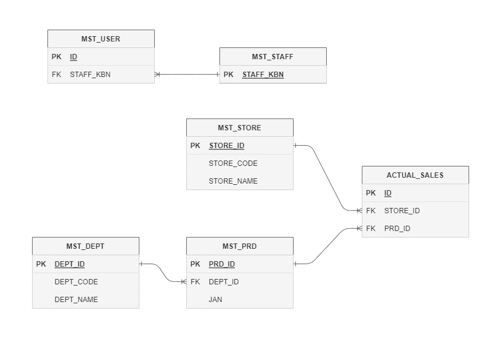

# 4. 演習問題(準備編)

- [4. 演習問題(準備編)](#4-演習問題準備編)
  - [4-1. 作成するテーブル](#4-1-作成するテーブル)
  - [4-2. 演習用のテーブルを作成](#4-2-演習用のテーブルを作成)
  - [4-3. データを投入する。(INSERT)](#4-3-データを投入するinsert)

## 4-1. 作成するテーブル

以下は今回演習で使用するテーブルの ER 図です。

主要なカラムのみ記載をしています。



## 4-2. 演習用のテーブルを作成

以下の DDL でテーブルを作成する。

```sql
/**********************************/
/* テーブル名: スタッフ区分マスタ */
/**********************************/
CREATE TABLE MST_STAFF(
    STAFF_KBN INT NOT NULL COMMENT 'スタッフ区分',
    STAFF_DESC VARCHAR(50) NULL COMMENT 'スタッフ名称',
    primary key(STAFF_KBN)
) COMMENT = 'スタッフ区分マスタ'
;
/**********************************/
/* テーブル名: ユーザーマスタ */
/**********************************/
CREATE TABLE MST_USER(
    ID INT NOT NULL AUTO_INCREMENT COMMENT 'ID',
    USER_ID VARCHAR(5) NOT NULL COMMENT 'ユーザーID',
    USER_PASS VARCHAR(10) NOT NULL COMMENT 'ユーザーパスワード',
    STAFF_KBN INT NOT NULL COMMENT 'スタッフ区分',
    STORE_CODE VARCHAR(4) NULL COMMENT '所属店舗コード',
    CREATE_DATETIME TIMESTAMP NOT NULL COMMENT '作成日',
    primary key(ID)
) COMMENT = 'ユーザーマスタ'
;
/**********************************/
/* テーブル名: 部門マスタ */
/**********************************/
CREATE TABLE MST_DEPT(
    DEPT_ID INT NOT NULL AUTO_INCREMENT COMMENT '部門ID',
    DEPT_CODE VARCHAR(3) NOT NULL COMMENT '部門コード',
    DEPT_NAME VARCHAR(50) NOT NULL COMMENT '部門名',
    primary key(DEPT_ID)
) COMMENT = '部門マスタ'
;
/**********************************/
/* テーブル名: 商品マスタ */
/**********************************/
CREATE TABLE MST_PRD(
    PRD_ID INT NOT NULL AUTO_INCREMENT COMMENT '商品ID',
    DEPT_ID INT NOT NULL COMMENT '部門ID',
    JAN BIGINT(13) NOT NULL COMMENT 'JANコード',
    PRD_NAME VARCHAR(50) NOT NULL COMMENT '商品名',
    primary key(PRD_ID)
) COMMENT = '商品マスタ'
;
/**********************************/
/* テーブル名: 店舗マスタ */
/**********************************/
CREATE TABLE MST_STORE(
    STORE_ID INT NOT NULL AUTO_INCREMENT COMMENT '店舗ID',
    STORE_CODE VARCHAR(4) NOT NULL COMMENT '店舗コード',
    STORE_NAME VARCHAR(25) NOT NULL COMMENT '店舗名',
    primary key(STORE_ID)
) COMMENT = '店舗マスタ'
;
/**********************************/
/* テーブル名: 売上実績 */
/**********************************/
CREATE TABLE ACTUAL_SALES(
    ID INT NOT NULL AUTO_INCREMENT COMMENT 'ID',
    STORE_ID INT NOT NULL COMMENT '店舗ID',
    PRD_ID INT NOT NULL COMMENT '商品ID',
    SALES_DATETIME DATETIME NOT NULL COMMENT '売上日時',
    SALES_QTY INT NOT NULL COMMENT '売上数量',
    primary key(ID)
) COMMENT = '売上実績'
;
```

## 4-3. データを投入する。(INSERT)

以下のデータを投入してください。

1. MST_STAFF

   | STAFF_KBN | STAFF_DESC |
   | :-------- | :--------- |
   | 0         | 店舗       |
   | 1         | 商品部     |

1. MST_USER

   | ID  | USER_ID | USER_PASS | STAFF_KBN | STORE_CODE | CREATE_DATETIME     |
   | :-- | :------ | :-------- | :-------- | :--------- | :------------------ |
   | 1   | USER1   | USER1     | 0         | 0012       | 2017-07-20 00:00:00 |
   | 2   | USER2   | USER2     | 1         |            | 2017-07-20 12:11:11 |

1. MST_DEPT

   | DEPT_ID | DEPT_CODE | DEPT_NAME |
   | :------ | :-------- | :-------- |
   | 1       | 001       | 菓子      |
   | 2       | 002       | 飲料      |
   | 3       | 003       | 酒        |
   | 4       | 019       | 生鮮      |

1. MST_PRD

   | PRD_ID | DEPT_ID | JAN            | PRD_NAME       |
   | :----- | :------ | :------------- | :------------- |
   | 1      | 1       | 1234567890123  | サンプル商品 1 |
   | 2      | 2       | 1234567890123  | サンプル商品 2 |
   | 3      | 1       | 182910101      | サンプル商品 3 |
   | 4      | 4       | 18291010118191 | サンプル商品 4 |

1. MST_STORE

   | STORE_ID | STORE_CODE | STORE_NAME     |
   | :------- | :--------- | :------------- |
   | 1        | 0001       | サンプル店舗１ |
   | 2        | 0012       | サンプル店舗 2 |
   | 3        | 1122       | テンプル店舗 3 |

1. ACTUAL_SALES

   | ID  | STORE_ID | PRD_ID | SALES_DATETIME      | SALES_QTY |
   | :-- | :------- | :----- | :------------------ | :-------- |
   | 1   | 2        | 1      | 2016-11-11 11:00:00 | 3         |
   | 2   | 2        | 2      | 2016-11-11 11:00:01 | 4         |
   | 3   | 2        | 1      | 2016-11-12 00:00:00 | 6         |
   | 4   | 1        | 1      | 2016-11-11 12:12:00 | 1         |
   | 5   | 3        | 1      | 2016-11-13 00:00:00 | 99        |

```

```
