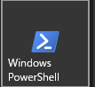
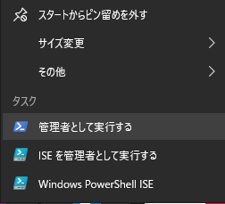

# WSL2 インストール方法

## PowerShell からインストール

以下のアイコンを右クリックで「管理者として実行する」を選択





## コマンド実行

以下のコマンドでインストールする。

```sh
wsl --install
```

:::tip

デフォルトのディストリビューションは Ubuntu になります。

:::

以下のコマンドを実行

```sh
 wsl -l -v
```

こんな感じになっていれば OK

```sh
  NAME      STATE           VERSION
* Ubuntu    Stopped         2
```

起動

```sh
wsl -d Ubuntu
```
